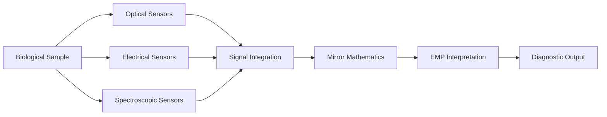

# System Overview

## Conceptual EMP Diagnostic Platform

## Description

This diagram illustrates a conceptual architecture for a future EMP-inspired diagnostic platform.

The diagram is intended only as a conceptual framework and does not represent an existing biomedical device.
