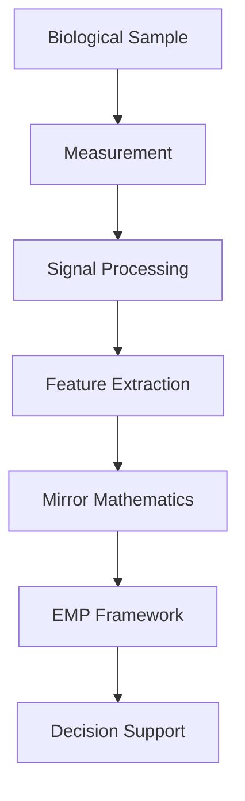

# Information Flow

```mermaid
flowchart TD

A[Biological Sample] --> B[Measurement]

B --> C[Signal Processing]

C --> D[Feature Extraction]

D --> E[Mirror Mathematics]

E --> F[EMP Framework]

F --> G[Decision Support]
```
