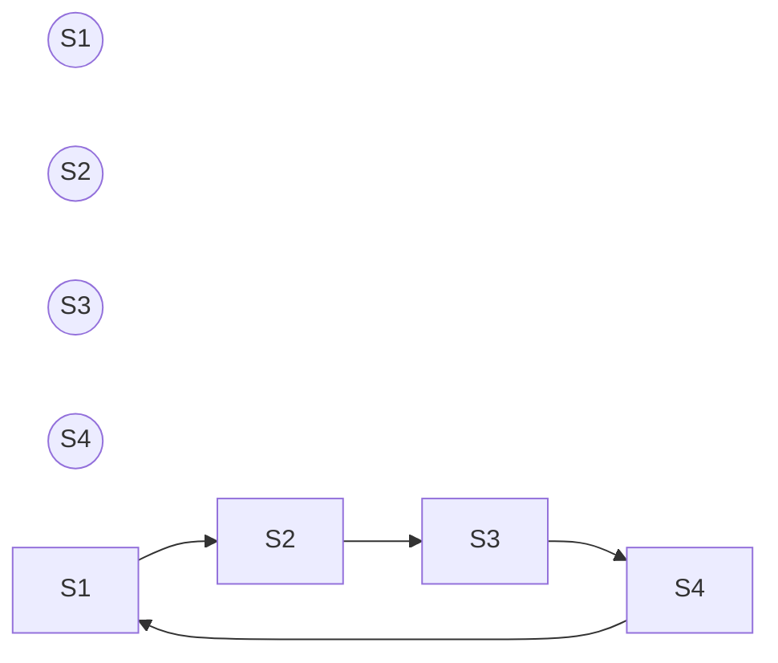

# Biological State Space

```mermaid
graph LR

State1((S1))

State2((S2))

State3((S3))

State4((S4))

S1 --> S2

S2 --> S3

S3 --> S4

S4 --> S1
```

Possible future work:

- Define state transitions.
- Introduce mathematical operators.
- Investigate state distances.
